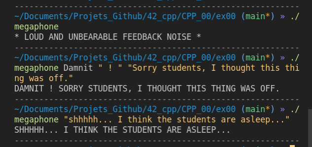
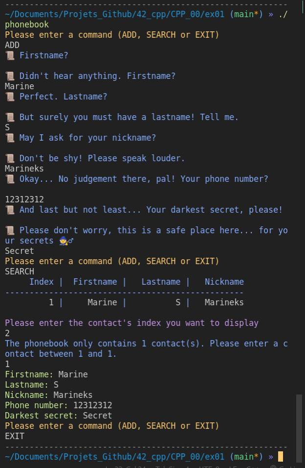

# CPP_modules

## Module 00

Module 00 is all about getting acquainted with CPP basics: Namespaces, classes, member functions, stdio
streams, initialization lists, static, const, and so on.

<details><summary>:loudspeaker: Ex00 - Megaphone 	:mega:  </summary>
<p>

A really straightforward exercice to practice with the iostream library and std::cout.


</p>
</details>

<details><summary>:bookmark_tabs: Ex01 - Phonebook :phone:  </summary>
<br></br>
<p>


 
Some issues I got and ressources which helped me solve them:

### Not being able to retrieve multiples words from std::cin

Example:
```cpp
std::string input;
std::cin >> input;

// If the input typed by the user is "Hello World", input will be equal to "Hello" and not "Hello World".
```
This issue was fixed with std::getline, which reads all the characters from an input stream and puts them onto a string.

```cpp
#include <iostream>
#include <string>
 
int main() {
    // Declare a firstname (String)
    std::string firstname;
 
    std::cout << "What is your firstname ?" << std::endl;
 
    // Get the input from std::cin and store into firstname
    std::getline(std::cin, firstname);
 
    return 0;
}
```

### Particularities of std::getline and std::cin

***Combining std::cin and std::getline***

If you try and run the following code, you will see that the *firstname* getline will be skipped and the *"lastname"* prompt will  be displayed. This is because of std::cin's usage just above. 

```cpp
int main(void)
{
   char *input;
   std::cout << "Please enter a one-word command" << std::endl;
   std::cin >> input; // Here is where std::cin precedes the usage of std::getline()
   
   if (input == "ADD")
   {
     std::string firstname;
     std::cout << "Enter your firstname" << std::endl;
     std::getline(std::cin, firstname);
     std::cout << "First name registered: " << firstname << std::endl;
     
     std::string lastname;
     std::cout << "Enter your lastname" << std::endl;
     std::getline(std::cin, lastname);
     std::cout << "Last name registered: " << lastname << std::endl;
   }
   return (0);
}
```
Explanation:

> "std::getline() does not ignore any leading white-space / newline characters. Because of this, if you call std::cin >> var; just before getline(), there will be a newline still remaining in the input stream, after reading the input variable. So, if you call getline() immediately after cin, you will get a newline instead, since it is the first character in the input stream! To avoid this, simply add a dummy std::getline() to consume this new-line character!"

**Ressource**
[How to use getline](https://www.journaldev.com/39743/getline-in-c-plus-plus#:~:text=Basic%20Syntax%20of%20std%3A%3Agetline()%20in%20C%2B%2B&text=We%20need%20to%20import%20the,string%26%20output%2C%20char%20delim)

***Catching errors with std::cin.fail()***

In this exercise, you will have to ask the user's input several times, in order to add a contact to the phonebook. I used std::getline() for strings and std::cin for the phone number, because we were dealing with (long) **ints**.

However, how do you prevent the user from entering some alpha characters and crashing the program? 

Well, you don't, buuuut you can catch the error with the method std::cin.fail():

```cpp

int main(void)
{
  long int phonenumber;
   
  std::cin >> phonenumber;
  if (std::cin.fail() == true) // For example if the input is invalid because it is not the right type
  {
    std::cin.clear(); // Clears the error flag from cin.fail();
    std::cin.ignore(); // Ignores the fail that just happened
    std::cout << "Invalid input ! Try again." << std::endl;
    std::cin >> phonenumber;
  }
  std::cout << "Good ! Your phonenumber is : " << phonenumber << std::endl;
}

```
**Ressource**
[How to use cin.fail() in c++ properly](https://stackoverflow.com/questions/33284483/how-to-use-cin-fail-in-c-properly)

***std::cin.ignore tip :***

If you try and keep asking for the user's input while the input given is wrong/triggers std::cin.fail(), your error_msg will repeat itself for as many times as there are chars in the input's string. To avoid this, use the argument:

```cpp
// will ignore any other input that is not an integer and will skip to the new line. 
   std::cin.ignore(std::numeric_limits<std::streamsize>::max(), '\n'); 
```
**Ressources**
[1](https://stackoverflow.com/questions/16726657/checking-for-valid-type-input-using-stdcin-c)
[2](https://stackoverflow.com/questions/66433755/stdcin-failure-leading-to-looped-if-statement-in-while-loop)


***Preventing the program from crashing with a EOF***

If the user's (or any tester) tries to end the program with CTRL+D while we are in the std::cin/getline stage, you will have a never-ending loop of your prompt. To catch this signal, use the std::cin.eof() method:

```cpp
	
void	askForNickname(Contact *contact)
{
	std::string	nickname;

	std::cout << BLUE << "📜 May I ask for your nickname?" << RESET << std::endl;
	std::getline(std::cin, nickname);
	if (std::cin.eof() == true) // If the program catches an EOF, exit safely the program
			exit(0);

	while (nickname.empty()) // aka "while the user keep hitting the return key"
	{
		std::cout << BLUE << "📜 Don't be shy! Please speak louder." << RESET << std::endl;
		std::getline(std::cin, nickname);
		if (std::cin.eof() == true)
			exit(0);
	}
	contact->setNickname(nickname);
	return ;
}
```


### Comparing strings (difference with C)

 ```cpp
#define SUCCESS 0

std::string input;
std::string add_command("ADD");

std::getline(std::cin, input);
std::cout << add_command.compare(input) == SUCCESS ? "OK" : "KO" << std::endl;
 
// is the same as:
std::cout << (input == "ADD") ? "OK" : "KO" << std::endl;
```
 
### Formatting your output on the terminal

No need to code formatting functions from scratch with the iomanip library! 

| Function         | Use                                                                   | Link  |
|------------------|-----------------------------------------------------------------------|-------|
| std::right       | Modifies the positioning of the fill characters in an output stream.  | [Here](https://en.cppreference.com/w/cpp/io/manip/left) |
| std::setw(int n) | Sets the field width to be used on output operations.                 | [Here](https://cplusplus.com/reference/iomanip/setw/)

**Useful member functions to truncate the strings according to the subject's needs:**
> "Si le texte dépasse la largeur de la colonne, il faut le tronquer et remplacer le dernier caractère affiché par un point (’.’)."

```cpp
std::string	trunc(std::string info)
{
	if (info.length() > 10)
	{
		info.resize(9); // keeps the first 9th chars of the string
		info.append("."); // appends a dot as required to the precedently modified string
	}
	return info;
}
```

All std::string member functions [here](https://cplusplus.com/reference/string/string/).
</p>
</details>


## Module 01

<!--pb pour imprimer addresse

 static cast trop cool a apprendre
 difference between a pointer and a reference
 https://stackoverflow.com/questions/57483/what-are-the-differences-between-a-pointer-variable-and-a-reference-variable +pb d'init constructeur avec une classe en param  / exo sed file exists: https://stackoverflow.com/questions/1647557/ifstream-how-to-tell-if-specified-file-doesnt-exist / exo sed directories : https://stackoverflow.com/questions/29310166/check-if-a-fstream-is-either-a-file-or-directory / pointer to functions / switch case prend que enums ou integrals -->

## Module 02

## Module 03

## Module 04

## Module 05

## Module 06

float fmod(float a, float b) => retourne le reste d'une division de a par b (ici, toujours 1)
		// instant nerd : difference remainder v. fmod = la façon dont on arrondit
		/*
			remainder : x - r * y, où r est le résultat de x/y, arrondi à la valeur entière la plus proche
			fmod : x _ t * y, où t est le résultat tronqué (aka arrondi vers 0) de x/y

			EXEMPLE : 
			double x = 5.1, y = 3;
			double result = remainder(x, y); => output is -0.9 (car 5.1/3 = 1.7, et là on arrondit à 2. Donc 5.1 - 2 * 3 = -0.9)
			double result2 = fmod(x, y); => output is 2.1
			Source: https://stackoverflow.com/questions/25734144/difference-between-c-functions-remainder-and-fmod 

## Module 07

